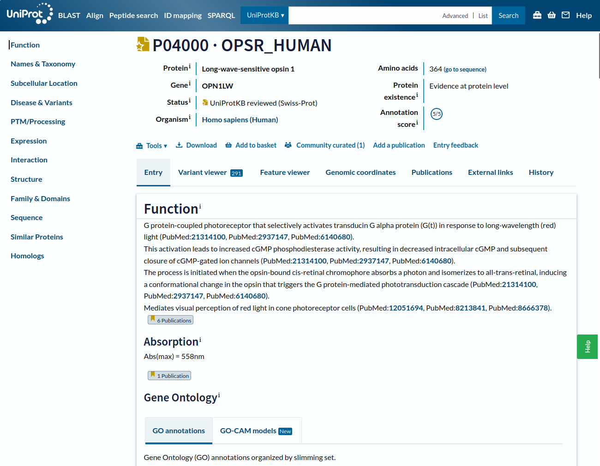

::: {.callout-important appearance="minimal" collapse="true"}
## Attribution and licence

This lesson is adapted from **"One protein along the UniProt page"** by Lisanna
Paladin and Bérénice Batut, Galaxy Training Network, published under a
[Creative Commons Attribution 4.0 International licence](https://creativecommons.org/licenses/by/4.0/).
Original material: <https://gxy.io/GTN:T00360>.

The text below has been rewritten and reorganised for this course. Any errors
introduced in adaptation are mine, not the original authors'. 
:::

## Overview {.unnumbered}

::: {.callout-note}
## Questions this lesson answers

- How can you search for proteins by free text, gene name, or protein name?
- How do you read the information at the top of a UniProt entry page?
- How is the function of a protein such as an opsin described?
- What structured information lives in the *Names and Taxonomy*, *Subcellular location*, *Disease & Variants*, and *PTM/Processing* sections?
- How do you find expression, interaction, structure, family, sequence, and similarity data?
- What do the *Variant viewer* and *Feature viewer* tabs add?
- What does the *Publications* tab list, and how can it be filtered?
- Why does the annotation history of an entry matter?
:::

::: {.callout-tip}
## Learning objectives

By the end of this session you should be able to:

1. Interpret a UniProtKB entry: function, taxonomy, localisation, structure, interactions, and variants.
2. Use stable unique identifiers to move between databases.
3. Visualise and compare sequence features along a protein.
:::

| | |
|---|---|
| **Time estimate** | ~1.5 hours |
| **Level** | Introductory |
| **Prerequisites** | Basic familiarity with genes, proteins, and molecular genomics features |
| **Software needed** | A web browser only |

: Practical details {.striped .hover tbl-colwidths="[25,75]"}

::: {.callout-caution appearance="simple" collapse="true"}
Numbers reported in the solutions below (counts of search hits, publications,
variants, and so on) were correct when the lesson was written. UniProt is
updated roughly every eight weeks, so your numbers may differ. That is a
feature, not a bug.

Ask yourself: Why does a knowledge base change?
:::

## Why is UniProt relevant for pharmaceutical sciences? {#sec-intro}

Almost every drug works by acting on a **protein**, and [UniProt](https://www.uniprot.org) is the central, trusted reference where you can find what that protein is, what it does, where it's found, how it varies between people and species, and which other resources (structures, drugs, pathways) are linked to it. 

Whatever direction your pharmaceutical career takes, you'll regularly need a reliable answer to "*what is this protein and why does it matter for this drug?*", and UniProt is where that answer lives.

## About this lesson

This lesson uses **human opsins** as a worked example. Opsins sit in the cells
of the retina, where they capture light and start the signalling cascade that
produces vision. When they are disrupted, the result can be colour blindness or
other visual impairment.

Almost all of the work happens on the [UniProt](https://www.uniprot.org)
website.

::: {.callout-note collapse="true"}
## Sources and further reading

The original Galaxy Training Network lesson drew on the UniProt help page
[Explore UniProtKB entry](https://www.uniprot.org/help/explore_uniprotkb_entry),
and chose the topic following Gale Rhodes'
[Bioinformatics Tutorial](https://spdbv.unil.ch/TheMolecularLevel/Matics/index.html).
The latter can no longer be followed step by step (the resources have changed
too much) but is still a good source of background on opsins and on building
structural models from evolutionary information.
:::

## Finding the right entry {#sec-search}

The starting point for protein annotation is [UniProtKB](https://www.uniprot.org/).
You can query it with free text, a gene name, or a protein name. Let us begin
with something deliberately vague.

::: {.callout-tip icon=false}
## 🔬 Hands on: a broad search

1. Open <https://www.uniprot.org/>.
2. Type `Human opsin` into the search bar.
3. Run the search.
:::

:::: {.callout-warning icon=false}
## ❓ Question

How many results come back?

::: {.callout-note collapse="true" title="Show answer"}
Around 524 (at the time of creating this tutorial). Far too many to inspect by hand, even though (spoiler alert) the entry we want is near the top.
:::
::::

Free text is too "vague". A better strategy is to search on a
**unique identifier**. The gene we are interested in called `OPN1LW`.

::: {.callout-tip icon=false}
## 🔬 Hands on: search by gene name

1. Type `OPN1LW` into the search bar.
2. Run the search.
:::

:::: {.callout-warning icon=false}
## ❓ Question

1. How many results now?
2. What is still missing from the query that could focus our search? *(Hint: Think about the organism of interest.)*

::: {.callout-note collapse="true" title="Show answer"}
1. Over 240 results (at the time of creating this tutorial).
2. Human is our organism of interest. The same gene name is used across many species, so by adding `Human` to the query, we restrict the search.
:::
::::

::: {.callout-tip icon=false}
## 🔬 Hands on: search by gene name plus organism

1. Type `Human OPN1LW` into the search bar.
2. Run the search.
:::

:::: {.callout-warning icon=false}
## ❓ Question

1. How many results now?
2. Is there a hit whose gene name is exactly OPN1LW?

::: {.callout-note collapse="true" title="Show answer"}
1. 8 results! (at the time of creating this tutorial).
2. Yes, the first hit carries the label `Gene: OPN1LW, RCP`.
:::
::::

That first hit, **P04000 (OPSR_HUMAN)**, is our target. Three things are worth
noticing before opening it:

- The protein name (`OPSR_HUMAN`) and the gene name (`OPN1LW`) are different,
  and so are their identifiers. Gene and protein are distinct entities with
  distinct names.
- The entry carries a **gold star**, meaning it has been **manually annotated and
  curated by a human** (Swiss-Prot) rather than generated automatically (via TrEMBL).
- The annotation score is `5/5`, meaning that its annotation is detailed and rich.

## Reading the entry page {#sec-entry}

::: {.callout-tip icon=false}
## 🔬 Hands on: open the entry

Click on `P04000 · OPSR_HUMAN`, or go directly to
<https://www.uniprot.org/uniprotkb/P04000/entry>.
:::

{#fig-uniprot fig-alt="Screenshot of the UniProt entry page header for P04000."}

The page is long, so the left-hand navigation bar does a lot of work. It stays
fixed as you scroll, and just reading it tells you what the database holds
about this entry:

::: {.grid}
::: {.g-col-6}
- known functions
- taxonomy
- subcellular location
- variants and associated diseases
- post-translational modifications (PTMs)
- expression
:::
::: {.g-col-6}
- interactions
- structure
- domains and their classification
- sequences
- similar proteins
- homologs
:::
:::

At the very top of the page you get the **"ID card"** of the protein: 

::: {.grid}
::: {.g-col-6}
- accession number and entry name
- the protein and gene names
- whether the entry has been reviewed by a curator (Status)
- the organism
:::
::: {.g-col-6}
- protein length (number of amino acids)
- the evidence level for the protein's existence
- and the annotation score (how well is the database entry annotated)
:::
:::

Below the header there are 7 tabs: *Entry*, *Variant viewer*, *Feature viewer*,
*Genomic coordinates*, *Publications*, *External links*, and *History*. 

Notice that just above the tabs is a toolbar: From the `Tools` you can BLAST the sequence, add the entry to a basket for later analysis, or `Download` it.

For now, we will continue on the **Entry** tab.

### Function {#sec-function}

The *Function* section opens with a short free-text summary: visual pigments
are the light-absorbing molecules behind vision, and consist of an apoprotein
(opsin) covalently bound to cis-retinal.

Two sentences to summarize decades of research. That compression is
possible because someone has already done the curation work, and because the
protein has been classified in the **Gene Ontology** (`GO`), which describes
molecular function, biological process, and cellular component.

[GO](https://geneontology.org/docs/ontology-documentation/) is a good example of a resource that flattens a very complex body of knowledge into a graph. Detail is lost, but in exchange the information becomes countable, comparable, and machine-readable, which is exactly what makes summary pages like this one possible.

:::: {.callout-warning icon=false}
## ❓ Question

1. Which GO terms is this protein annotated with, for:

  - molecular function?
  - biological process?

2. Explore the GO-CAM models tab. What information does it provide? (Hint: Use the green HELP button on the right side to deepen your knowledge.)

::: {.callout-note collapse="true" title="Show answer"}
1. GO annotation:
  - Molecular Function: G protein-coupled receptor, Photoreceptor protein, Receptor, Retinal protein, Transducer.
  - Biological Process: Sensory transduction, Vision.

2. This proteins is part of the "Red light signaling mediated by OPN1LW photoreceptor via G-alpha-t(transducin)_Visual perception" model. It interacts directly or indirectly with 6 other genes, and requires Calcium and Sodium ions.
:::
::::

### Names and taxonomy {#sec-names}

The next section holds more structured information, including the taxonomic
placement of the protein. It also lists other identifiers that point at the same
biological entity, or at linked entities (for example associated diseases under
`MIM`).

:::: {.callout-warning icon=false}
## ❓ Question

1. What is the taxonomic identifier of the organisms that presents this protein?
2. What is the proteome identifier?

::: {.callout-note collapse="true" title="Show answer"}
1. 9606, that is *Homo sapiens*.
2. UP000005640, and this protein is a component of chromosome X.
:::
::::

### Subcellular location {#sec-location}

We already know where the protein is in the body (the retina). But, where is it in
the cell?

:::: {.callout-warning icon=false}
## ❓ Question

1. Where does UniProt place this protein within the cell?
2. Is that consistent with the description in the `GO Annotation` tab?

::: {.callout-note collapse="true" title="Show answer"}
1. It is described by UniProt as a multi-pass membrane protein: it is embedded in the membrane and crosses it several times.
2. Yes. GO is more specific, naming the cone photoreceptor disc membrane.
:::
::::

This section also has a *Features* area showing which portions of the sequence
sit inside the membrane (transmembrane) and which do not (topological domain).

:::: {.callout-warning icon=false}
## ❓ Question

How many transmembrane and topological domains are listed?

::: {.callout-note collapse="true" title="Show answer"}
7 transmembrane regions and 8 topological domains.
:::
::::

### Disease and variants {#sec-disease}

This gene and protein are linked to several diseases. The section describes
those associations and lists the specific variants implicated in each.

:::: {.callout-warning icon=false}
## ❓ Question

**Critical thinking question**

Use your favorite Large Language Model (LMM) AI chat to ask the following question: 

*"In the context of studying the effects of genetic variants, what types of study establish that a genetic variant is associated with a disease? Answer in brief, clear, and scientific tone for postgraduate pharmaceutical sciences students."*

Compare your answer with the answers of your colleagues: Is it correct? Is it complete? Does it match your knowledge? How do you validate the answer?

::: {.callout-note collapse="true" title="Show answer"}
There are, at least, 3 common study designs:

- **Genome-wide association studies (GWAS).** Scan whole genomes across large
  cohorts to find common variants that track with a trait or disease.
- **Case-control studies.** Compare the frequency of specific variants between
  affected and unaffected individuals.
- **Family studies.** Follow inheritance patterns within families in which
  several members are affected, which can pinpoint candidate genes.

:::
::::

A *Features* area maps the natural variants along the sequence, and points you
to the more detailed view in the *Variant viewer* app. Do not click on it yet! Resist the temptation for now.

### PTM and processing {#sec-ptm}

A post-translational modification (PTM) is a covalent event after translation: either a proteolytic cleavage, or the addition of a chemical group to an amino acid (e.g. glycosylation adds sugar, lipidation adds fats).

:::: {.callout-warning icon=false}
## ❓ Question

1. Which post-translational modifications are annotated here?
2. What is the meaning of these modifications? *(Hint: Click the `i` next to the title `PTM/Processing` to see a table of the possible PTMs.)*

::: {.callout-note collapse="true" title="Show answer"}
1. Chain, glycosylation, disulfide bond, and modified residue.
2. These PTMs mean:

  - Chain: Extent of a polypeptide chain in the mature protein.
  - Glycosylation: Covalently attached glycan group(s).
  - Disulfide bond: Cysteine residues participating in disulfide bonds.
  - Modified residue: Modified residues excluding lipids, glycans and protein crosslinks.
:::
::::

### Expression {#sec-expression}

For human proteins there is often tissue-level expression information, drawn
from resources such as the [Expression Atlas](https://www.ebi.ac.uk/gxa/home).

:::: {.callout-warning icon=false}
## ❓ Question

In which tissue is this protein found?

::: {.callout-note collapse="true" title="Show answer"}
The three colour pigments are found in the cone photoreceptor cells.
:::
::::

### Interaction {#sec-interaction}

Proteins do their work by interacting with their surroundings, and above all
with other proteins. This section lists known interactors in a table you can
filter by subcellular location, disease, and interaction type. Much of the
underlying data comes from databases such as STRING, which is linked directly.

::: {.callout-tip icon=false}
## 🔬 Hands on: follow the link out to STRING

1. Click on the `STRING` link for this protein, and open it in a new tab. Note how many proteins the default network has.
2. Add more proteins to the network by clicking a few times on the `+ More` button.
3. In the Clusters tab select `k-means clustering`, ask for `4 clusters` and hit `Apply`. 
4. Now test the other clustering options. Note the functions of the clusters found.
:::

:::: {.callout-warning icon=false}
## ❓ Question

1. How many proteins does the default network contain? 
2. What are the overall functions of the 4 clusters obtained by k-means?
3. How many clusters does the MCL algorithm find, and what are their functions?
4. How many clusters does the Leiden algorithm find, and what are their functions?

::: {.callout-note collapse="true" title="Show answer"}
1. 11 proteins
2. Signalling, Light detection, retina proteins, and Tex28 (single protein).
3. 1 cluster related to signalling.
4. 2 clusters related to signalling and light sensing.

:::
::::

### Structure {#sec-structure}

The *Structure* section is the way into the three-dimensional world. It reports
experimentally determined structures where they exist, and gives you an
interactive viewer embedded in the page, so you can rotate the molecule and
explore domains, binding sites, and other functional regions without leaving
UniProt.

::: {.callout-tip icon=false}
## 🔬 Hands on: Explore the 3D structure of the protein

1. Rotate the protein in the viewer. Zoom in and out with the mouse wheel. 
2. Notice  the different colors and cartoon shapes (helices, and sheets).
3. Explore the different models from `PDB`, `AlphaFoldDB`, and `Others`.
4. Notice just below the title `Structure`, the banner "View UniProt features on this structure in the Feature Viewer." Click and open it in a new tab.
5. Click on `Variants`, and select only `Likely pathogenic or pathogenic`.
6. Click on any variant and notice that the 3D structure below highlights the location of the variant.
7. Now select only the `UniProt reviewed` variants.
:::

:::: {.callout-warning icon=false}
## ❓ Question

1. How many variants are `Likely pathogenic` and `UniProt reviewed`?
2. What diseases are associated with the previous variants?
3. Can you propose why might amino acid substitutions be disruptive to the protein structure? 
4. How do you explain that different variants located in different places of the protein result in the same disease? 

::: {.callout-note collapse="true" title="Show answer"}
1. 3 variants.

2. The disease associated with each variant is:

  - Variant 203: C>R (C203R); Disease association: Blue cone monochromacy (BCM).
  - Variant 307: P>L (P307L); Disease association: Blue cone monochromacy (BCM).
  - Variant 338: G>E (G338E); Disease association: Colorblindness, partial, protan series (CBP).
  
3. Each amino acid has a specific size, charge, polarity, and flexibility that contribute to how the protein folds and holds its 3D shape. When one is replaced by an amino acid with very different properties (for example, a small residue by a bulky one, or a neutral residue by a charged one), it can break important bonds or interactions, distort helices or binding pockets, and prevent the protein from folding correctly, which in turn impacts its function.

4. A protein's function depends on its overall 3D structure, not on a single residue. Different mutations can damage different parts of the protein (folding, the retinal pocket, signalling regions), but they all converge on the same outcome: the red opsin is missing or cannot respond properly to light. The disease reflects this shared loss of function, while the severity can vary. 

:::
::::

### Family and domains {#sec-family}

Going back to the `Entry` tab, the `Family and Domains` section places the protein in its evolutionary context: the families,
superfamilies, and domains it belongs to, plus conserved regions, motifs, and
other notable sequence features.

The *Features* area confirms that at least one of the two protruding domains
(the N-terminal one) is disordered, and reiterates that we are dealing with a
transmembrane protein. 

The links out to phylogenetic and domain databases are
the route into questions of common ancestry and functional specialisation.

### Sequence {#sec-sequence}

Everything above is ultimately encoded in the amino acid sequence. Here you can download
the FASTA file, trace the data back to the sequencing experiments that produced
it, and see any protein isoforms that have been detected.

:::: {.callout-warning icon=false}
## ❓ Question

How many potential isoforms map to this entry? How long are they?

::: {.callout-note collapse="true" title="Show answer"}
One potential isoform: H0Y622, which is 164 amino acids long.
:::
::::

### Similar proteins and Homologs {#sec-similar}

The final two sections of the *Entry* tab lists similar proteins produced by
clustering at 100%, 90%, and 50% identity thresholds, and the Homologs section provides orthology and paralogy information which has been retrieved from the Alliance of Genome Resources (AGR). 

**Recall**

**Orthology** describes genes from different species that have evolved from a common ancestral gene through a speciation event, meaning these genes typically perform similar functions across species. 

**Paralogy**, refers to genes within the same species that originated from duplication events, often resulting in genes with related but distinct functions.

:::: {.callout-warning icon=false}
## ❓ Question

1. How many similar proteins are there at each threshold: 100%, 90% and 50% similarity?

2. How many genes are classified as paralogous to OPN1LW?

::: {.callout-note collapse="true" title="Show answer"}

1. Similar protein numbers:

| Identity threshold | Similar proteins |
|---|---|
| 100% | 0 |
| 90% | 101 |
| 50% | 516 |

: Cluster membership {.striped}

2. 11 paralogous genes in human.

:::
::::

---

A pattern should be emerging: much of what we do with protein data is mapping
different layers of information onto the same sequence and asking how they
relate. The next two tabs do exactly that, visually.

## Variant viewer {#sec-variant-viewer}

::: {.callout-tip icon=false}
## 🔬 Hands on

Click the *Variant viewer* tab on top.
:::

This view maps every known alternative version of the sequence. Some have a
known effect (pathogenic or benign); many do not.

:::: {.callout-warning icon=false}
## ❓ Question

1. How many variants create a stop codon (*) (keeping all consequences and all provenances)? 
2. Is their effect relevant for disease (pathogenic)? Can you propose a reason why? 

::: {.callout-note collapse="true" title="Show answer"}

1. 6 variants create a stop (*).

2. 3 are likely pathogenic (half of teh total variants). 
Stop codon variants can be pathogenic because they may cause premature termination of translation, producing a shortened, nonfunctional protein or triggering degradation of its mRNA through nonsense-mediated decay (NMD). Less commonly, loss of the normal stop codon causes excessive protein extension, which can also disrupt function.

:::
::::

The sheer number of variants is a useful corrective. A "protein sequence" (like
a gene sequence, or a structure) is much less of a fixed object than the
singular canonical entry suggests.

## Feature viewer {#sec-feature-viewer}

::: {.callout-tip icon=false}
## 🔬 Hands on

Click the *Feature viewer* tab.
:::

The *Feature viewer* merges all the *Features* areas scattered through the
*Entry* page into one track-based display: domains and sites, molecule
processing, PTMs, topology, proteomics, and variants. Clicking a feature
highlights the corresponding region in the structure.

::: {.callout-tip icon=false}
## 🔬 Hands on: locate the variant in context

1. Expand the *Variants* track.
2. Zoom out.
3. Click the blue point at position 2.
:::

:::: {.callout-warning icon=false}
## ❓ Question

1. What is the topology and the domain at position 2?

2. Which positions of the protein present Post Translational Modifications (PTMs)?

::: {.callout-note collapse="true" title="Show answer"}

1. Position 2 has an extracelular topology, and it falls in a disordered domain.

2. CARBOHYD 22-22; CARBOHYD 34-34; DISULFID 126-203; MOD_RES 312-312.

:::
::::

## Publications {#sec-publications}

::: {.callout-tip icon=false}
## 🔬 Hands on

Click the *Publications* tab.
:::

This tab lists papers relevant to the protein, combining a manually curated list
(from UniProtKB/Swiss-Prot) with automatically imported references. 

On the left side you can filter by source, by the category of data a paper contributes (function, interaction, sequence, and so on), and by study size (small scale versus large scale).

:::: {.callout-warning icon=false}
## ❓ Question

1. How many publications are linked to this protein? *(Hint: Sum all the sources.)*
2. How many of them contribute information about its function?

::: {.callout-note collapse="true" title="Show answer"}
1. 63 (at the time of creating this tutorial).
2. 30 (at the time of creating this tutorial).
:::
::::

## External links {#sec-external}

::: {.callout-tip icon=false}
## 🔬 Hands on

Click the *External links* tab.
:::

This tab gathers every cross-reference scattered across the `Entry` into one
place. The link text usually shows the identifier that represents the same
entity in the other database, which is what makes automated cross-referencing
possible at all.

For a sense of how tangled that web is, look at the [bioDBnet network diagram](https://biodbnet-abcc.ncifcrf.gov/dbInfo/netGraph.php). Databases are
the major nodes, identifiers the minor ones, and the region around the UniProt
entry name, Gene ID, and Ensembl Gene ID is extremely dense. The diagram is
already partly out of date, which rather makes the point.

## History {#sec-history}

::: {.callout-tip icon=false}
## 🔬 Hands on

Click the *History* tab.
:::

The *History* tab exposes every previous version of the entry's annotation, in
this case going back to 1988, and lets you download them. It is a record of how
knowledge about this protein has accumulated and been revised.

:::: {.callout-warning icon=false}
## ❓ Question

How many versions of this entry have there been?

::: {.callout-note collapse="true" title="Show answer"}

Since its first release in 01 November 1988 (38 years ago), this protein has had 219 versions (in October 2026)!

:::
::::

## Key points {.unnumbered}

::: {.callout-tip icon=false}
## Take home messages

- UniProtKB entries collect function, taxonomy, localisation, interactions, 3D structure, homology and much more in one curated place.
- Search on unique identifiers, not free text, whenever you can.
- The *Variant viewer* and *Feature viewer* let you see variants, domains,
  modifications, and topology mapped onto the sequence.
- External links and shared identifiers are what let you cross-reference between
  resources.
- The *History* tab shows that annotation is a moving target, not a fixed fact.
:::

## References {.unnumbered}

Original lesson:

> Paladin, L. and Batut, B. *One protein along the UniProt page* (Galaxy
> Training Materials). <https://gxy.io/GTN:T00360>. Licensed CC BY 4.0.

Primary resource:

> The UniProt Consortium. UniProt: the Universal Protein Knowledgebase.
> <https://www.uniprot.org/>
