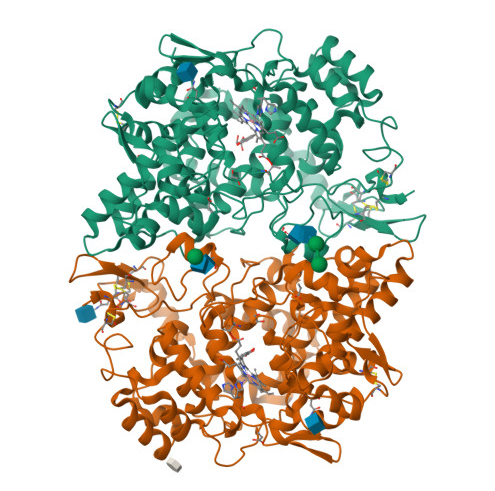

## Overview {.unnumbered}

::: {.callout-note}
## Questions this tutorial answers

- How do you search the PDB by free text, protein name, UniProt accession, or PDB ID?
- What does the "ID card" at the top of a Structure Summary page tell you?
- How good is a structure? What do resolution and R-values mean?
- Which molecules are in the entry, and which of them actually matter biologically?
- How do you see, in 3D, where a drug sits and which residues it touches?
- What do the *Ligand*, *Annotations*, *Sequence*, *Genome*, *Experiment* and *Versions* pages add?
:::

::: {.callout-tip}
## Learning objectives

By the end of this session you should be able to:

1. Find and interpret a PDB entry: experiment, quality, molecules, ligands, and assembly.
2. Explore a protein-ligand complex in 3D with the Mol\* viewer.
3. Use identifiers (PDB ID, UniProt accession, ligand ID, DrugBank ID) to move between databases.
4. Critically judge whether a structure is reliable enough for the question you want to ask.
:::

| | |
|------------------|------------------------------------------------|
| **Time estimate** | ~1.5 hours |
| **Level** | Introductory |
| **Prerequisites** | The UniProt tutorial; basic knowledge of amino acids and protein structure |
| **Software needed** | A web browser only |

: Practical details {tbl-colwidths="[25,75]"}

::: {.callout-caution appearance="simple"}
Numbers reported in the solutions below (search hits, number of entries containing a ligand, and so on) were correct when the tutorial was written. The PDB releases new structures **every week**, so your numbers may differ.

Ask yourself: Why would an old entry, deposited in 2015, still receive new versions today?
:::

## Why is the PDB relevant for pharmaceutical sciences? {#sec-intro}

In the UniProt tutorial you learned *what* a protein is and *what* it does. The [Protein Data Bank (PDB)](https://www.rcsb.org) shows you what it **looks like**, atom by atom, often with a drug sitting in its binding pocket.

That view is the foundation of **structure-based drug design**: once you can see the pocket, you can explain why a drug binds, why a mutation causes resistance, or why a molecule hits one target but not a closely related one. Many modern drugs, such as the HIV protease inhibitors and many kinase inhibitors, were designed or optimised with the help of PDB structures. And structures of COX-2, the enzyme in this tutorial, explained why "coxib" drugs can block COX-2 while sparing COX-1.

The PDB is a single worldwide archive run by the **wwPDB** partners. [RCSB PDB (USA)](https://www.rcsb.org) is one of its portals; [PDBe (Europe)](https://www.ebi.ac.uk/pdbe/) and [PDBj (Japan)](https://pdbj.org/) serve the *same* data with different tools. The archive holds structures solved experimentally (X-ray crystallography, cryo-electron microscopy, NMR), and RCSB also displays computed models (for example from AlphaFold), clearly labelled as such.

## About this tutorial {#sec-about}

Aspirin and other non-steroidal anti-inflammatory drugs (NSAIDs) block the **cyclooxygenase** enzymes, COX-1 and COX-2, which start the production of prostaglandins (the local messengers behind pain, fever and inflammation). Aspirin is unusual: it does not just sit in the enzyme, it **transfers an acetyl group** onto a serine in the active site (Ser-530) and then leaves as **salicylate**.

The PDB entry used shows human COX-2 with salicylate bound. Its UniProt protein is Human *Prostaglandin G/H synthase 2* (the UniProt page complements the information on PDB, so it is useful to have both pages open side by side.

::: {.callout-note collapse="true"}
## Background reading

- PDB-101 *Molecule of the Month* on [Cyclooxygenase](https://pdb101.rcsb.org/motm/17) (D. Goodsell, 2001): a short, beautifully illustrated introduction to aspirin's target.
- The RCSB [Guide to understanding PDB data](https://pdb101.rcsb.org/learn/guide-to-understanding-pdb-data/introduction): short pages on resolution, R-values, biological assemblies and more.
:::

## Finding the right entry {#sec-search}

The search bar sits at the top of every RCSB page. Like UniProt, it accepts free text, but it also accepts identifiers from other databases.

::: {.callout-tip icon=false}
## 🔬 Hands on: a broad search

1. Open <https://www.rcsb.org>.
2. Type `cyclooxygenase-2` in the search bar and run the search (click the magnifying glass icon or hit enter).
3. Look at the left-hand panel of the results page (the *refinements*).
:::

::: {.callout-warning icon=false}
## ❓ Question

1. How many structures come back? Write the number down.
2. Which categories can you use to narrow the list on the left-hand side?

::: {.callout-note collapse="true"}
## Show answer

1. **184** structures are matched by this query (the exact number grows every week). Too many to browse by hand, and they include COX-2 from several species and with many different inhibitors.
2. Among others: *Organism*, *Experimental Method*, *Refinement Resolution*, *Release Date*, *Protein modifications*, and more. Refinements are the quickest way to cut a large result set down to what you need.
:::
:::

As with UniProt, a **unique identifier** is a much sharper tool than free text.

::: {.callout-tip icon=false}
## 🔬 Hands on: search by UniProt accession and refine

1. Search for `Human Prostaglandin G/H synthase 2` in [UniProt](https://www.uniprot.org/).
2. Select the entry from *PTGS2* gene. Note the UniProt id number.
3. In [RCSB PDB](https://www.rcsb.org) search with the UniProt accession number. 
4. In the refinements, tick *Experimental Method: X-RAY DIFFRACTION*.
5. Sort the results in the right-hand box by *Resolution* (best to worst).
:::

::: {.callout-warning icon=false}
## ❓ Question

1. What is the UniProt accession of human COX-2? 
2. Why does searching by UniProt accession give a cleaner list than `cyclooxygenase-2`?
3. Find **5F1A** in the list (or simply type `5F1A` in the search bar). What happens when you search for an exact PDB ID?

::: {.callout-note collapse="true"}
## Show answer

1. P35354 
2. The accession points to exactly one protein from one organism. Every hit is human COX-2, whereas the free text also matches mouse COX-2, COX-1, and papers that merely mention the name.
3. You land directly on the Structure Summary page of that entry. A PDB ID is unique, so there is nothing to choose between.
:::
:::

::: {.callout-note}
## PDB IDs are getting longer

Classic PDB IDs have four characters (a digit plus three letters or digits). Because the archive is running out of combinations, the wwPDB is introducing **extended IDs**. The page header already shows both forms: `5F1A` and `pdb_00005f1a`. They refer to the same entry.
:::

## Reading the Structure Summary page {#sec-summary}

::: {.callout-tip icon=false}
## 🔬 Hands on: open the entry

Go to <https://www.rcsb.org/structure/5F1A>.
:::

{#fig-assembly width=50% fig-align="center"}

Along the top there is a row of tabs: 

  - *Structure Summary* 
  - *Structure*
  - *Annotations* 
  - *Experiment* 
  - *Sequence*
  - *Genome*
  - *Ligands* 
  - *Versions* 

On the right, the *Download Files* menu gives you the FASTA sequence, the coordinates files (PDBx/mmCIF or legacy PDB format), the experimental data, and the validation report.

We will start now on the **Structure Summary** tab and scroll down.

### The ID card {#sec-idcard}

The header tells you, in a few lines, what was studied and how: title, DOI, classification, organism, expression system, mutations, deposition and release dates, and authors.

::: {.callout-warning icon=false}
## ❓ Question

1. In which organism was the protein made (expression system)? Why not simply use the bacterial system *E. coli*? *(Hint: look at the Macromolecules section and the sugars listed further down the page.)*
2. How long did it take from deposition to release? Why is there a delay at all?

::: {.callout-note collapse="true"}
## Show answer

1. *Spodoptera frugiperda*, insect cells (the baculovirus system). COX-2 is a eukaryotic, glycosylated, membrane-associated enzyme. Bacteria cannot add sugars (N-glycosylation) and often fail to fold such proteins correctly. Insect cells do both.
2. Deposited 2015-11-30, released 2016-03-16: about three and a half months. Entries are processed and validated by wwPDB biocurators, and authors can hold release until their paper is published.
:::
:::

### Experimental snapshot: how good is this structure? {#sec-quality}

Every structure is a **model** built to explain experimental data. Before you trust it, check two things.

- **Resolution** (in Å) describes the level of detail in the data. *Smaller is better*: at around 1.5 Å you can see individual atoms; at around 3.5 Å you see the shape of side chains but not their fine detail.
- **R-values** measure how well the model agrees with the data. **R-work** uses the data the model was built on. **R-free** uses a small set (around 5%) of data kept aside as a test. *Lower is better*, and R-free should not be much higher than R-work.

::: {.callout-warning icon=false}
## ❓ Question

1. What method was used, and what are the resolution, R-work and R-free?
2. Look at the coloured **wwPDB validation slider**. What metrics are shown, and what is their meaning? (*Hint: Click the `?` icon to obtain more information*).

::: {.callout-note collapse="true"}
## Show answer

1. X-ray diffraction, 2.38 Å, R-work 0.174, R-free 0.218. This is a good, typical-quality structure: detailed enough to place a small ligand like salicylate, and the gap between R-work and R-free (about 0.04) is normal.
2. Each bar compares one quality metric (such as R-free, clashscore, Ramachandran outliers and side-chain outliers) with all other X-ray structures in the PDB, and with structures of similar resolution. Markers towards the blue end are better than most; towards the red end, are worse.
:::
:::

::: {.callout-warning icon=false}
## ❓ Question

**Critical thinking question**

Use your favourite Large Language Model (LLM) AI chat to ask:

*"Explain what R-free is in X-ray crystallography, why it was introduced, and what values indicate a reliable structure. Answer briefly, for postgraduate pharmaceutical sciences students."*

Compare answers with your colleagues. Do they agree on the "good" values? How could you check them? *(Hint: the PDB-101 guide has a page on R-values [here](https://pdb101.rcsb.org/learn/guide-to-understanding-pdb-data/crystallographic-structure-factors-and-electron-density-resolution-and-r-value).*

::: {.callout-note collapse="true"}
## Show answer

R-free is calculated with a random subset of the data (typically 5 to 10%) that is excluded from refinement. Because the model never "saw" those data, R-free cannot be improved by over-fitting, so it is an honest test of the model. As a rough rule, R-free values near or below 0.25 are typical of well-refined structures at medium resolution, and the gap to R-work is usually below about 0.05. Always compare with structures of similar resolution rather than trusting one fixed threshold.
:::
:::

### Literature {#sec-literature}

Each entry is linked to its **primary citation**, with its abstract.

::: {.callout-warning icon=false}
## ❓ Question

1. Which paper describes this structure, and which other PDB entries were published with it?

::: {.callout-note collapse="true"}
## Show answer

1. Lucido *et al.* (2016) Crystal Structure of Aspirin-Acetylated Human Cyclooxygenase-2: Insight into the Formation of Products with Reversed Stereochemistry. *Biochemistry* 55: 1226-1238. 
Related structures: **5F19** (aspirin-acetylated human COX-2) and **5FDQ** (a mouse COX-2 mutant, S530T).

:::
:::

### Macromolecules and assembly {#sec-macromolecules}

The *Macromolecules* table lists every polymer chain: its name, chains, length, organism, gene and EC number, with links out to UniProt, PHAROS and GTEx. Just above it, the page describes the **biological assembly**.

::: {.callout-note}
## Asymmetric unit versus biological assembly

A crystal is built from a small repeating box, the **asymmetric unit**: what the crystallographer actually modelled. It may contain one copy of the protein, several, or half of a functional complex. The **biological assembly** is the form believed to exist in the cell. They are not always the same, so check which one you are looking at.
:::

::: {.callout-warning icon=false}
## ❓ Question

1. How many protein chains are there, and how many residues long is each?
2. What is the global stoichiometry and symmetry of the biological assembly?
3. How many glycosylation sites are annotated?

::: {.callout-note collapse="true"}
## Show answer

1. Two chains (A and B) of the same protein, Prostaglandin G/H synthase 2, 553 residues each. Only one residue of the 1,106 deposited is missing from the model.
2. Homo 2-mer (A2), with cyclic C2 symmetry: COX-2 works as a **dimer** of two identical subunits (@fig-assembly).
3. Two. The sugar chains (N-acetylglucosamine and mannose) appear in the *Oligosaccharides* section, confirming the protein was glycosylated by the insect cells.
:::
:::

### Small molecules {#sec-ligands}

Now scroll to the *Small Molecules* table. Each ligand has a short **three-character ID** (its "chemical component" code), a name, a formula and links to its 3D interactions.

<!-- ::: {.callout-warning icon=false} -->
<!-- ## ❓ Question -->

<!-- 1. Six different small molecules are listed. Sort them into three groups: **the drug**, **natural partners** of the enzyme, and **leftovers from the experiment**. -->
<!-- 2. The enzyme normally carries heme (iron protoporphyrin IX). What is found instead? -->
<!-- 3. The *Binding Affinity* table reports a Ki of 1.00e+4 nM for salicylate. Convert it to µM. Is salicylate a potent COX-2 inhibitor? -->

<!-- ::: {.callout-note collapse="true"} -->
<!-- ## Show answer -->

<!-- 1. - Drug: **SAL**, 2-hydroxybenzoic acid (salicylic acid). -->
<!--    - Natural partners: **COH** (in place of heme) and **NAG**, the glycosylation sugar. -->
<!--    - Experimental leftovers: **BOG** (octyl glucoside, a detergent used to keep the membrane protein soluble), **AKR** (acrylic acid) and **EDO** (ethylene glycol), from the crystallization and cryo-protection solutions. -->
<!-- 2. **COH**, protoporphyrin IX containing **cobalt**. Replacing iron with cobalt gives a catalytically inactive enzyme that keeps its shape, a common trick in COX crystallography to capture complexes without the reaction taking place. -->
<!-- 3. 10 µM (IC50 is 40 µM). That is weak: potent drugs typically bind in the nanomolar range. Salicylate's effect depends on the high doses reached in the body, and aspirin's power comes from **permanently** acetylating the enzyme, not from tight binding. -->
<!-- ::: -->
<!-- ::: -->

::: {.callout-tip}
## Not every ligand is biology

A structure faithfully records *everything* in the crystal, including buffers, detergents and cryoprotectants. Before you draw conclusions about a "ligand", check whether it makes sense biologically, and check the *Experiment* page (@sec-experiment) for what was in the crystallization drop.
:::

## Exploring in 3D with Mol\* {#sec-3d}

The **Mol\*** (MolStar) viewer is built into the RCSB site. You do not need to install anything.

::: {.callout-tip icon=false}
## 🔬 Hands on: look at the whole protein

1. Click the **Structure** tab (or *Explore in 3D: Structure* under Biological Assembly 1).
2. Rotate (left-click and drag), zoom (scroll wheel) and move (right-click and drag).
3. In the right-hand panel, open *Components* and turn on and off the visibility (`eye` icon) of the polymer, the ligands, the carbohydrates and the water.
4. Notice the tool bar on the right side the viewport. Click the *Expanded viewport* icon (looks like a square) to expand the viewer to full screen. You must leave the expanded viewer to access the panel options again. 
5. Hover over any part of the molecule and read the label at the bottom right: chain, residue name and number.
6. Explore the viewer window header and its options (select a molecule from the box, and then click on its components to zoom-in to it).
7. Reload the page to reset the viewing parameters.
:::

::: {.callout-warning icon=false}
## ❓ Question

1. How many copies of the ligands salicylate (*2-HYDROXYBENZOIC ACID*) and cobalt porphyrin (*PROTOPORPHYRIN IX CONTAINING CO*) can you find, and in which chains? *(Hint: In the right-hand panel you can hide from view the molecules that are not ligands).* What does that tell you about the active sites?
2. What secondary structure dominates COX-2: helices or sheets (cartoon arrows)?

::: {.callout-note collapse="true"}
## Show answer

1. Two of each: one salicylate and one porphyrin per chain. Each subunit of the dimer carries its own complete set of active sites.
2. Mainly **alpha helices**. The small beta-sheet regions belong mostly to the EGF-like domain.
:::
:::

Now zoom in on the drug.

::: {.callout-tip icon=false}
## 🔬 Hands on: the salicylate binding site

1. Go back to the *Structure Summary* tab. In the *Small Molecules* table, find the **SAL** row and click *Interactions: Focus chain E [auth A]*.
2. The view zooms in on salicylate, shows the surrounding residues as sticks, and draws **dashed lines for non-covalent interactions** (hydrogen bonds, ionic, pi-stacking, hydrophobic).
3. Hover over the neighbouring residues and over the dashed lines to identify them.
4. Measure a distance: switch on *selection mode* (arrow icon on the right of the viewer), click the salicylate hydroxyl oxygen and then the side-chain oxygen (OG) of **Ser-499** (they become highlighted in green), and then in the *Measurements* section of right-hand panel click `Add` *Distances*.
5. Repeat steps 1 to 4 for the salicylate in chain B (*Focus chain L [auth B]*).
:::

::: {.callout-warning icon=false}
## ❓ Question

1. Which residues surround salicylate? Which of them form hydrogen bonds or ionic interactions with it?
2. What distance did you measure between salicylate and **Ser-499**, the residue that aspirin acetylates? 
3. Does salicylate bind in the same way in both chains?

::: {.callout-note collapse="true"}
## Show answer

<!-- INSTRUCTOR: fill in the exact contact list and the Ser-530 distance from Mol* before class. -->

1. Salicylate sits inside the long, mostly hydrophobic **cyclooxygenase channel**, the same channel where the natural substrate, arachidonic acid, binds. Useful landmarks in this channel are **Arg-80** and **Tyr-324** (the "constriction" near the entrance), **Tyr-354** (the catalytic tyrosine) and **Ser-499** (aspirin's acetylation target). Your list of contacts should include residues from this set plus hydrophobic neighbours; the polar interactions involve salicylate's carboxylate and hydroxyl groups.
2. Chain A: 6.03 Å. Chain B: 5.67 Å.
3. The pose is very similar in the two chains (remember that 1 Å = 10⁻¹⁰ meters). Small differences between chains are common: each copy in the crystal is an independent observation.
:::
:::

::: {.callout-tip icon=false}
## 🔬 Hands on: is the ligand really there?

1. Back on the Structure Summary page, click **Interactions & Density** for SAL (chain E).
2. The mesh around the atoms is the **electron density**: the experimental evidence for where the atoms are.
3. Compare the density around salicylate with the density around a well-ordered residue next to it.
:::

::: {.callout-warning icon=false}
## ❓ Question

Why is it worth checking the electron density for a ligand, rather than simply trusting its coordinates?

::: {.callout-note collapse="true"}
## Show answer

The coordinates of a ligand are placed by the crystallographer. If the density does not clearly cover the ligand, its position (or even its presence) may be doubtful. For drug design this matters a lot: a wrongly placed ligand leads to wrong conclusions about which interactions drive binding. The *Ligands* tab of the entry summarises this with **ligand quality scores** (fit to density and geometry).
More information on this subject will be approached in the Drug modelling module.
:::
:::

## The ligand page {#sec-ligand-page}

Every chemical component in the PDB has its own page.

::: {.callout-tip icon=false}
## 🔬 Hands on

In the *Small Molecules* table, click the ligand ID **SAL**, or go to <https://www.rcsb.org/ligand/SAL>.
:::

::: {.callout-warning icon=false}
## ❓ Question

1. In how many PDB entries is SAL found as a standalone ligand? And covalently linked?
2. What is its DrugBank ID? What is salicylic acid used for?
3. Look at the `Drug Targets` table. Besides *Prostaglandin G/H synthase 1* (COX-1) and *Prostaglandin G/H synthase 2* (COX-2), which other human proteins are listed? Why could this matter for a patient?

::: {.callout-note collapse="true"}
## Show answer

1. 73 entries as a standalone ligand and 2 where it is covalently linked (at the time of writing).
2. **DB00936**. It is widely used in dermatology (acne, psoriasis, warts, corns), and its salts, the salicylates, are used as analgesics and anti-inflammatories.
3. Several **carbonic anhydrases**, an aldo-keto reductase, **cytochrome P450 2C9** (as a substrate), albumin, and organic anion transporters (OAT1, OAT3). These are potential **off-targets** and routes of metabolism and transport: they help explain side effects and drug-drug interactions.
:::
:::

::: {.callout-note}
## Ligand IDs are another universal key

Just as `P35354` identifies a protein, `SAL` identifies a chemical component across the whole archive. From the ligand page you can also run a **chemical similarity search** to find structures with related molecules: a first step in exploring structure-activity relationships.
:::

## Annotations {#sec-annotations}

::: {.callout-tip icon=false}
## 🔬 Hands on

Click the **Annotations** tab.
:::

This page gathers what *other* resources say about the protein chains: structural domain classifications (SCOP2, ECOD, CATH), protein families (Pfam, InterPro), Gene Ontology terms, and disease associations (Pharos).

::: {.callout-warning icon=false}
## ❓ Question

1. Which two kinds of domain do CATH and InterPro identify in COX-2?
2. What is the Pfam family? What does it tell you about COX-2's evolutionary relatives?
3. Name three diseases associated with COX-2 in the Pharos section. Why would a drug target be linked to so many diseases?

::: {.callout-note collapse="true"}
## Show answer

1. An **EGF-like** (laminin-type) domain, and a large **haem peroxidase** domain (animal type), which holds both the peroxidase and cyclooxygenase active sites.
2. PF03098, *Animal haem peroxidase*. COX-2 belongs to the same family as enzymes like myeloperoxidase (SCOP2 calls it *Myeloperoxidase-like*): its peroxidase function is ancient; the cyclooxygenase activity is its specialisation.
3. For example rheumatoid arthritis, colorectal cancer, familial adenomatous polyposis, gastric ulcer, cardiovascular disease. Prostaglandins act in almost every tissue, so COX-2 is involved in inflammation, cancer, the cardiovascular system and more. This is also why COX inhibitors have both wide uses and wide side effects.
:::
:::

## Sequence and Genome {#sec-sequence}

::: {.callout-tip icon=false}
## 🔬 Hands on

1. Click the **Sequence** tab. Look at the tracks aligned along the sequence of chain A: the UniProt sequence, the modelled regions, secondary structure, domains and binding sites.
2. Click the `Explore Sequence Annotations in 3D` link on top of the sequence viewer and highlight, for example, the `secondary structure` domains to see their 3D location compared to their 2D linear sequence.
3. Then click the **Genome** tab.
:::

::: {.callout-warning icon=false}
## ❓ Question

1. The crystallized chain is 553 residues long. How long is the full human COX-2 in UniProt (P35354)? Which parts are missing, and why might that be? *(Hint: In the `Feature viewer` tab of `UniProt` explore the `PDBe coverage` and the `Molecule processing` tracks to check which regions are not solved in 3D).*
2. On which chromosome is the *PTGS2* gene located?

::: {.callout-note collapse="true"}
## Show answer

1. 604 residues. The N-terminal **signal peptide** (cleaved off naturally when the protein enters the endoplasmic reticulum) is not part of the crystallized chain, and the chain stops before the flexible **C-terminal tail**. Flexible, disordered regions are often removed or simply not visible in crystal structures: a structure rarely shows the whole protein.
2. Chromosome 1 (1q31). The Genome view maps the protein back onto its gene, exons and transcripts, connecting to what you did in the Ensembl tutorials.
:::
:::

## Experiment and validation {#sec-experiment}

::: {.callout-tip icon=false}
## 🔬 Hands on

1. Click the **Experiment** tab. Observe the rich standardized description of the experimental settings used to obtain this data record. 
2. From the `Structure Summary` page, open the **Full Report** (wwPDB validation report, PDF). This is the document that sustains this database entry.
:::

The *Experiment* tab records how the structure was obtained, from crystal to final model. You do not need to understand every number, but three points are worth noticing for 5F1A.

**Crystallization.** The protein was crystallized by sitting-drop vapour diffusion at pH 7.5 and 23 °C (296 K). The solution contained polyacrylic acid, HEPES buffer, magnesium chloride and 0.6% octyl glucoside, a detergent that keeps this membrane-associated protein soluble. This explains two of the "leftover" ligands present in the `Small Molecules` section: **BOG** is the octyl glucoside itself, and **AKR** (acrylic acid) most likely comes from the polyacrylic acid.

**Data collection.** The diffraction data were collected at a **synchrotron** (the Advanced Photon Source, beamline 17-ID), at the temperature of 100 K. Crystals are routinely frozen like this to limit damage from the very intense X-ray beam.

**Structure solution.** The structure was solved by **molecular replacement**: a previously known, similar COX-2 structure was used as the starting model. For well-studied proteins like COX-2, this is the quickest route to a new structure, for example a new drug complex.

## Versions {#sec-versions}

::: {.callout-tip icon=false}
## 🔬 Hands on

Click the **Versions** tab.
:::

::: {.callout-warning icon=false}
## ❓ Question

1. How many versions of this entry exist?
2. Two updates are labelled *Remediation*. What was fixed in each?
3. Did the authors' experimental data change in any of these versions?

::: {.callout-note collapse="true"}
## Show answer

1. Seven (version 1.0 in March 2016 up to version 2.2 in August 2026).
2. **Carbohydrate remediation** (version 2.0, 2020): the archive-wide re-description of sugar chains. **Metalloprotein remediation** (version 2.2, 2026): a re-description of metal sites, relevant here because of the cobalt porphyrin.
3. No. Updates concern annotation, derived calculations, and how the data are represented. As in UniProt, the knowledge *around* an entry keeps improving, even when the experiment stays the same.
:::
:::

## Going further (optional) {#sec-further}

If you finish early, try one of these.

::: {.callout-tip icon=false}
## 🔬 Hands on: before and after aspirin

1. Navigate to the main page of [RCSB PDB](https://www.rcsb.org), click the *All tools* button, and select *Analysis*. Open the *Pairwise Structure Alignment* tool (click *Go to Tool*).
2. Align chain A of **5F1A** (salicylate) with chain A of **5F19** (aspirin-acetylated COX-2). Leave the default alignment method, and click *Compare*.
3. In 5F19, find Ser-530 and look at its side chain. In 5F1A, compare it with where salicylate sits.
:::

## Key points {.unnumbered}

::: {.callout-tip icon=false}
## Take home messages

- A PDB entry is an **experimental model**: always check method, resolution and R-values before trusting details.
- Search with **identifiers** (PDB ID, UniProt accession, ligand ID) rather than free text whenever you can.
- The **biological assembly** may differ from what was modelled in the crystal.
- Not every small molecule in a structure is biologically relevant: detergents, buffers and cryoprotectants are recorded too.
- **Mol\*** lets you see exactly where a drug binds and which residues it touches; the **electron density** tells you whether to believe it.
- Ligand, annotation, sequence and genome pages connect the structure to DrugBank, UniProt, Pfam, GO and the genome.
- The *Versions* tab shows that even an archived structure keeps being curated.
:::

## References {.unnumbered}

Primary citation for 5F1A:

> Lucido, M.J., Orlando, B.J., Vecchio, A.J. and Malkowski, M.G. (2016) Crystal structure of aspirin-acetylated human cyclooxygenase-2: insight into the formation of products with reversed stereochemistry. *Biochemistry* 55: 1226-1238. <https://doi.org/10.1021/acs.biochem.5b01378>

Primary resource:

> Burley, S.K. *et al.* RCSB Protein Data Bank. <https://www.rcsb.org/>. Entry 5F1A: <https://doi.org/10.2210/pdb5F1A/pdb>

